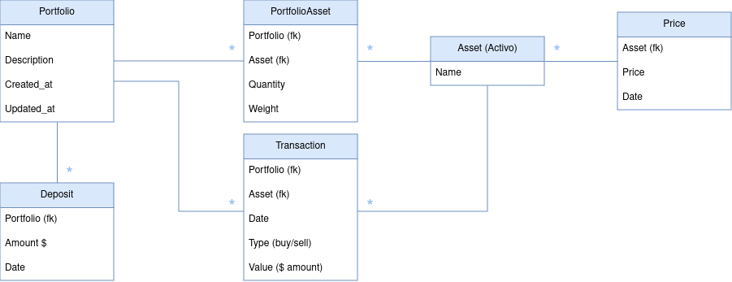

# AbacusApp - Fintech API

## Overview

AbacusApp is a fintech-related Django API designed to manage portfolios, assets, and transactions. The application allows users to track portfolio performance, manage asset prices, and execute buy/sell transactions. It was designed based initially on [HackSoftware's Django-Styleguide](https://github.com/HackSoftware/Django-Styleguide) format to maintain consistency and best practices.

## Setup

### Prerequisites

- Docker
- Docker Compose
- A laptop with internet access lol

### Setup Instructions

1. **Clone the repository:**

    ```bash
    git clone https://github.com/afar-rafa/abacusAPI.git
    cd abacusAPI
    ```

    ⚠️ _Important: Delete any `db.sqlite3` file if there's any before starting._

1. **Build the image and run the app:**

    - This will start the API for you:

        ```bash
        make docker-build
        make docker-start
        ```

1. **Set up DB:**

    - Then, on a **separate shell**, run:

        ```bash
        make docker-shell   # exec into the container
        make quick-setup    # Run migrations & Create a superuser
        ```

1. **Authenticate:**

    - Go to http://0.0.0.0:8000/admin
    - Login with the creds you just made
    - Go back to http://localhost:8000/ to see the menu

1. **Load your data:**

    - Go to http://0.0.0.0:8000/upload-excel
    - Upload your `datos.xlsx` file
    - See the magic happen in the API logs

Vroom vroom, you're good to go!

1. Once you're done using the API, remember to stop the containers

    ```bash
    make docker-stop   # cleaup
    ```

## The tasks requested

1. _Cree un proyecto en Django que permita modelar la definición anterior._

    The current DB structure goes as follows more or less, which can be checked on the [models.py](/abacusAPI/apps/abacusapp/models.py) file:

    

1. _Genere una función tipo ETL que permita leer y cargar los datos del archivo datos.xlsx_

    - This was already done during setup:
    - http://0.0.0.0:8000/upload-excel

1. _Calcule las cantidades iniciales ($C_{i,0}$) para cada uno de los 17 activos en cada uno de los 2 portafolios_

    - First make a deposit on each portfolio on the specified date:
        - `http://0.0.0.0:8000/deposits/`
        - ⚠️ _**WARNING**: Notice that the API UI uses the EEUU date format (month-day-year)._
    - Then you can check the quantities for said date here:
        - `http://0.0.0.0:8000/portfolios/2/daily_value/?date=2022-02-15`

1. *Genere endpoints tipo API rest que reciban los parametros `fecha_inicio` y `fecha_fin` y entregue los valores entre esas fechas para $w_{i,t}$ y $V_t$.*

    - Use the following endpoint, using the respective ID:
        - http://0.0.0.0:8000/portfolios/1/daily_values/?fecha_inicio=2022-02-15&fecha_fin=2022-02-28

1. _**Bonus 1**: Genere un view que utilice la API anterior donde se pueda comparar de manera gráfica la evolución en el tiempo de las variables $w_{i,t}$ y $V_t$._

    - Use the following endpoint, using the respective ID:
        - http://0.0.0.0:8000/portfolios/1/plot/?fecha_inicio=2022-02-15&fecha_fin=2022-02-17

1. _(...) un metodo que permita procesar compra ventas de activos_

    - Use the following endpoint, using `value` as the amount of cash to be invested on the Asset:
        - http://0.0.0.0:8000/transactions

## General Endpoints

### Portfolio Endpoints

- `/portfolios/`
- `/portfolios/{id}/`
- `/portfolios/{id}/daily-value/`
- `/portfolios/{id}/daily-values/`

### Asset Endpoints

- `/assets/`
- `/assets/{id}/`

### Price Endpoints

- `/prices/`
- `/prices/{id}/`

### Transaction Endpoints

- `/transactions/`
- `/transactions/{id}/`

### Excel Upload Endpoint

- `/upload-excel/`

### Additional Features

- **Pagination**: Implemented to handle large datasets.
- **Logging**: Configured some logging to track important actions within the application.

## Testing

You can run the tests using:

```bash
make test
```

Tho i just added formatting for now. You can run the formatters with `make format`.